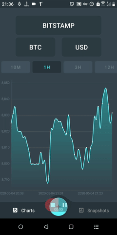
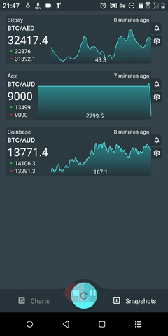
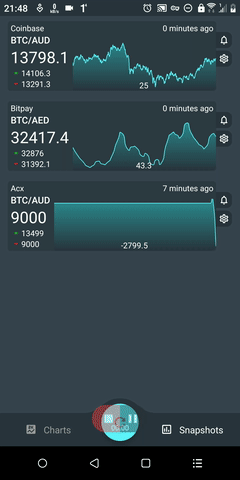

## xChanges Rates

### Overview

Android application which helps you to get in touch with crypto currencies in real time.

*Supports most of the crypto currencies, not only Bitcoin*

Monitor <b>all available</b> crypto currencies from <b>over 90 exchangers</b> across the globe. Check currency last changes with filters - 10 mins, 1 hour, 12 hours, 1 week, 1 month, half a year, year or more, using awesome chart. Save interesting charts to <b>quick access</b>. And enable notification for most interesting ones.

<b>Features:</b>

  ★ Supports all existing crypto currencies - Bitcoin, Ethereum, Litecoin, Ripple, etc;

  ★ Over 90 exchangers across the globe;

  ★ Stylish chart view;

  ★ With filters  - 10 mis, 1 hour, 24 hours, 1 month or even 2 years;

  ★ Notifications for saved crypto currencies also named as Snapshot (ETH/EUR, BTC/USD...);

  ★ User-friendly interface and navigation;

    
    
    

## Tech-stack

This simple app uses a lot of popular libraries. Most of the libraries are in the stable version, unless there is a good reason to use non-stable dependency.

### Dependencies

-   [Jetpack](https://developer.android.com/jetpack):
    -   [Android KTX](https://developer.android.com/kotlin/ktx.html) - provide concise, idiomatic Kotlin to Jetpack and Android platform APIs.
    -   [AndroidX](https://developer.android.com/jetpack/androidx) - major improvement to the original Android [Support Library](https://developer.android.com/topic/libraries/support-library/index), which is no longer maintained.
    -   [Data Binding](https://developer.android.com/topic/libraries/data-binding) - allows you to bind UI components in your layouts to data sources in your app using a declarative format rather than programmatically.
    -   [Lifecycle](https://developer.android.com/topic/libraries/architecture/lifecycle) - perform actions in response to a change in the lifecycle status of another component, such as activities and fragments.
    -   [LiveData](https://developer.android.com/topic/libraries/architecture/livedata) - lifecycle-aware, meaning it respects the lifecycle of other app components, such as activities, fragments, or services.
    -   [Room](https://developer.android.com/topic/libraries/architecture/room) - persistence library provides an abstraction layer over SQLite to allow for more robust database access while harnessing the full power of SQLite.
    -   [ViewModel](https://developer.android.com/topic/libraries/architecture/viewmodel) - designed to store and manage UI-related data in a lifecycle conscious way. The ViewModel class allows data to survive configuration changes such as screen rotations.
    -   [WorkManager](https://developer.android.com/topic/libraries/architecture/workmanager) - makes it easy to schedule deferrable, asynchronous tasks that are expected to run even if the app exits or device restarts.
-   [Coroutines](https://kotlinlang.org/docs/reference/coroutines-overview.html) - managing background threads with simplified code and reducing needs for callbacks.
-   [Koin](https://insert-koin.io/) - A pragmatic lightweight dependency injection framework for Kotlin developers. Written in pure Kotlin using functional resolution only: no proxy, no code generation, no reflection!.
-   [Material Design](https://material.io/) - material design components for Android.
-   [MPAndroidChart](https://github.com/PhilJay/MPAndroidChart) - A powerful Android chart view / graph view library.
-   [FancyShowCaseView](https://github.com/faruktoptas/FancyShowCaseView) - An easy-to-use customisable show case view with circular reveal animation.
-   [Hawk](https://github.com/orhanobut/hawk) - Secure, simple key-value storage for Android.
-   [SpaceNavigationView](https://github.com/armcha/Space-Navigation-View) - Space Navigation is a library allowing easily integrate fully customizable Google Spaces like navigation to your app.
-   [Fragmentation](https://github.com/JantHsueh/Fragmentation) - A powerful library that manage Fragment for Android.
-   [Timber](https://github.com/JakeWharton/timber) - a logger with a small, extensible API which provides utility on top of Android's normal Log class.
-   [and more...](./dependencies/dependencies.gradle)

### Test dependencies

... soon
